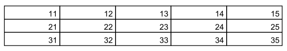

test_0001
=========

"test_0001" is for testing table extraction in [PDFProdigy](http://www.pdfprodigy.com) with a very simple table with all the borders, no header and no spanning.

This folder contains 6 PDF files with this _testing table_, one file for each PDF version ([from version 1.2 to 1.7](http://en.wikipedia.org/wiki/Portable_Document_Format)).

Those PDF files were created by a Java program (_Cf._ test_XXXX.java in this folder) developped thanks to the ([Java library IText](http://itextpdf.com/))

File list of this folder: 

   - **README.md**: this file
   - **test_XXXX_v1.2.pdf**: the PDF file in version 1.2
   - **test_XXXX_v1.3.pdf**: the PDF file in version 1.3
   - **test_XXXX_v1.4.pdf**: the PDF file in version 1.4
   - **test_XXXX_v1.5.pdf**: the PDF file in version 1.5
   - **test_XXXX_v1.6.pdf**: the PDF file in version 1.6
   - **test_XXXX_v1.7.pdf**: the PDF file in version 1.7
   - **test_XXXX.csv**: the tested table in [CSV format](http://en.wikipedia.org/wiki/Comma-separated_values)
   - **test_XXXX.png**: a screenshot of the table in PDF format
   - **test_XXXX.java**: the source of the Java program which created all the PDF files
   - **compile.bat**: the DOS command line to compile the Java program
   - **run.bat**: the DOS command line to run the Java program
