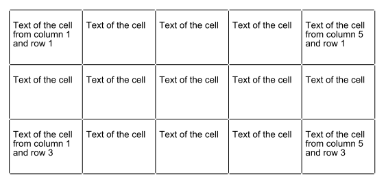

test_0011
=========

"test_0011" is for testing table extraction in [PDFProdigy](http://www.pdfprodigy.com) with a very simple table with all the borders, no header and no spanning.
However, the lines of each cell border do not connect to each other (as in [test_0009](../test_0009/) and [test_0010](../test_0010/) but with a smaller gap size of 0.8), and there are three lines of text (aligned to the left) in several cells but not all.

This PDF files was created by a Java program (_Cf._ test_XXXX.java in this folder) developped thanks to the ([IText Java library](http://itextpdf.com/)).

File list of this folder:

   - **README.md**: this file
   - **test_XXXX.pdf**: the PDF file (version 1.7)
   - **test_XXXX.png**: a screenshot of the table in PDF format
   - **test_XXXX.java**: the source of the Java program which created the PDF file
   - **compile.bat**: the DOS command line to compile the Java program
   - **run.bat**: the DOS command line to run the Java program
