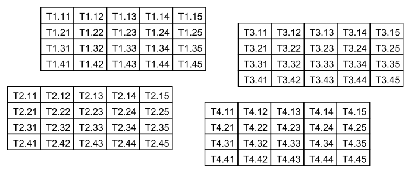

test_0017
=========

"test_0017" is for testing table extraction in [PDFProdigy](http://www.pdfprodigy.com) with four tables. Several columns and rows of each table are aligned with columns and rows of other tables. The complexity of this test is to extract the 4 tables not 2 or 1.

This PDF files was created by a Java program (_Cf._ test_XXXX.java in this folder) developped thanks to the ([IText Java library](http://itextpdf.com/)).

File list of this folder:

   - **README.md**: this file
   - **test_XXXX.pdf**: the PDF file (version 1.7)
   - **test_XXXX.png**: a screenshot of the table in PDF format
   - **test_XXXX.java**: the source of the Java program which created the PDF file
   - **compile.bat**: the DOS command line to compile the Java program
   - **run.bat**: the DOS command line to run the Java program
